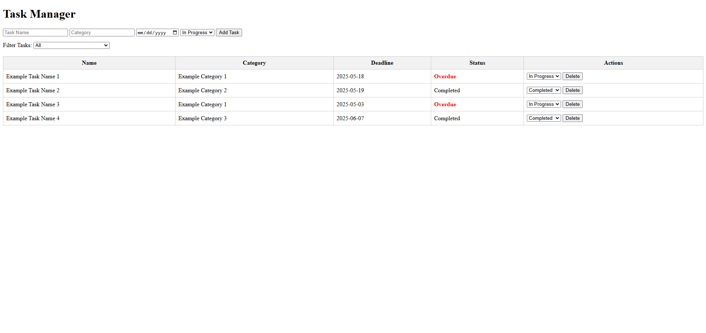
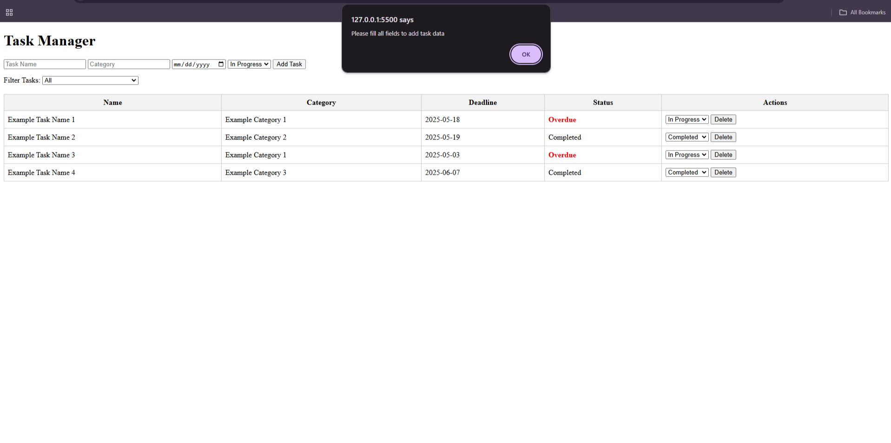
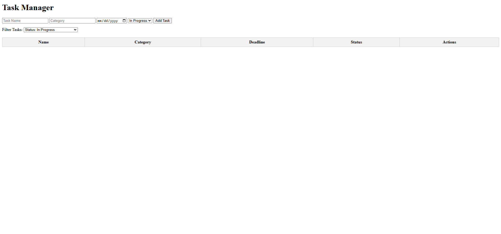
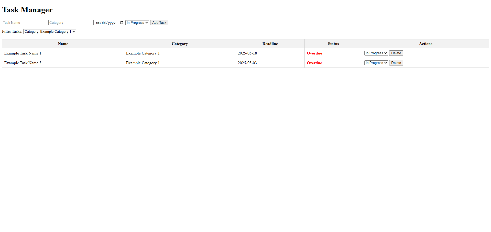
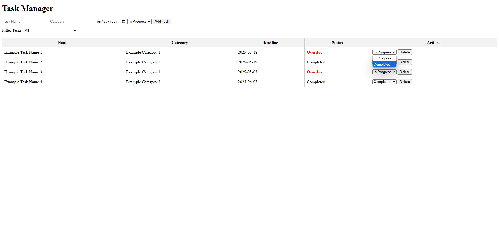
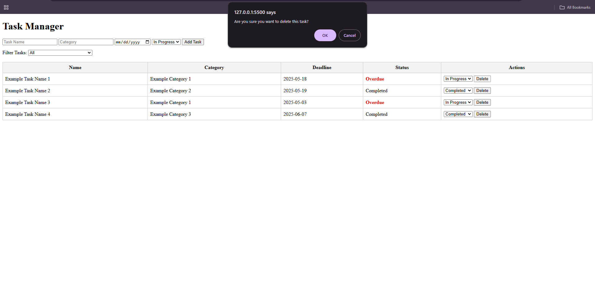

# Task Management App

## Overview

For this assignment, I was tasked with building a dynamic **Task Management App** with the intended goals:

1. Add new tasks with details such as the task name, category, deadline, and status.
2. Update the status of tasks to reflect their progress (e.g., “In Progress,” “Completed,” “Overdue”).
3. Automatically update task status based on the current date (tasks past their deadline will be marked as “Overdue”).
4. Filter tasks by status or category.
5. Persist task data using local storage so tasks are saved even after refreshing the page.

To implement the core functionality of this assignment, I applied a wide range of JavaScript concepts, including **arrays**, **objects**, **DOM manipulation**, **conditionals**, and **local storage** to persist the task data.

[Click Here to Access Task Management App](https://htmlpreview.github.io/?https://github.com/jcwynder/task-management-app/blob/main/index.html)

## App Preview

Task Management App


Alert if input fields are left blank upon submission from Add Task button


Functionality of task filter by status


Functionality of task filter by category


Update status functionality


Delete task data functionality


## Implementation

To begin working on this assignment, I created 3 files:

- `<index.html>` file to render my task data and allow users to ultilize the features I created.
- `<styles.css>` file to apply styling to app.
- `<app.js>` file to implement functionality for the the app's requirements.

### HTML Structure

After creating my required files, I proceeded into the `<index.html>` file to create the HTML structure of the app.

This app is composed of 3 primary sections:

- Input fields (wrapped in a `<div>`) to collect and proccess entered data.
- A filter dropdown (also wrapped in a `<div>`) that allows users to filter task data based on selected filter option(s).
- A table to render task data, which includes a task's name, category, deadline, status, and actions.

### App Styling

After creating my HTML structure, I moved onto the `<styles.css>` file to apply styling to the app.

I did not implement a great deal of styling. The styling I applied is used to control the layout, appearance, and readability of elements in the task management interface—especially the filter dropdown, table, and status indicators.

Here's a list of the applied styles I used and their intended purpose:

- ```
  #filterPosition {
    margin-top: 15px;
  }
  ```

  - Used to add spacing above the filter dropdown (with `id="filterPosition"`) to visually separate it from elements above, improving layout clarity.

- ```
  table {
  width: 100%;
  border-collapse: collapse;
  margin-top: 20px;
  }
  ```

  - Used to stretch table across full width of its container, remove space between table cell borders for a cleaner look, and add space between the table and the element above it for visual separation.

- ```
  th,
  td {
  border: 1px solid #ccc;
  padding: 8px;
  }
  ```

  - Used to Adds a light gray border around all table header (`<th>`) and data (`<td>`) cells and ensure there's space between the text and the cell borders, improving readability.

- ```
  th {
  background-color: #f2f2f2;
  }
  ```

  - Used to apply a light gray background color to header cells to visually distinguish the table headers from the rest of the table rows.

- ```
  .overdue {
  color: red;
  font-weight: bold;
  }
  ```

  - Used to visually highlight overdue tasks by applying the color red and bold styling to the overdue text entries.

### Logic Implementation

After applying styles to the app, the final phase of this assignment required me to implement the logic of the app to the `<app.js>` file in order to ultilize the functions I need to include.

Below is a brief overview of the order of JavaScript code implemented:

- Created empty array to store task data as an object.

- Created function to save user task data to their loacl storage.

- Created function to render user task data.

- Created function to update user task data

- Created function to delete user task data.

- Created function to add user task data.

- Created function to implement functionality for user to load task data from their local storage whenever app page is refreshed.

## Reflection

### Challenge(s) Faced

Throughout this assignment, I encountered one major challenge that required me to revisit concepts I thought I had mastered and deepen my understanding of some core JavaScript fundamentals.

While I was already comfortable with implementing functionality for tasks like storing data as objects, rendering, updating, deleting, and saving/loading data from local storage, the biggest hurdle came when I had to get the filter dropdown options to properly filter the task data based on the selected criteria.

### Approach to Solving Challenge(s)

I had to look into how to utilize the given and generated options within the filter dropdown once selected to only render task data whose information matched the selected options.
To solve this, I had to explore how to utilize the selected options from the dropdown to display only the tasks whose properties matched the filter. I began by creating a variable to store the selected filter options. Then, I implemented an array to iterate through the stored values and ensure that the correct options were selected when the dropdown was refreshed.

This approach allowed me to filter the task data efficiently, ensuring that only the tasks matching the selected criteria were rendered on the page.

### What I Would Improve

Looking ahead, if I had more time, I would implement a feature that allows users to update all properties of the rendered task data (task name, category, and deadline) directly, rather than having to create a new task entry to make changes. Additionally, I would enhance the user interface with color and accessibility improvements to make the app more visually appealing and user-friendly.
